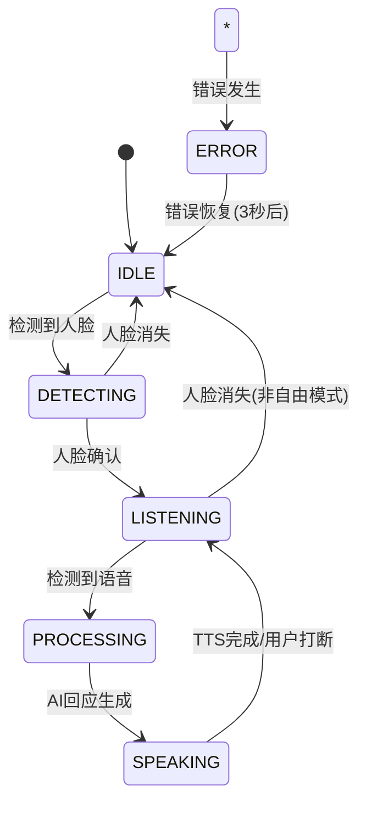

# 智慧语音助理 - 技术架构设计

## 系统架构概述

本项目采用 Clean Architecture + MVVM 架构模式，实现了高度模块化和可测试的代码结构。

## 架构层次

### 1. Presentation Layer (表现层)

**职责**: 处理UI逻辑和用户交互

```
app/src/main/java/com/voiceassistant/app/presentation/
├── main/
│   ├── MainActivity.kt          # 主界面Activity
│   └── MainViewModel.kt         # 主界面ViewModel
└── adapter/
    └── ConversationAdapter.kt   # 对话列表适配器
```

**关键组件**:
- `MainActivity`: 管理相机预览、权限处理、UI状态更新
- `MainViewModel`: 业务逻辑协调、状态管理、数据绑定
- `ConversationAdapter`: 对话历史展示和管理

### 2. Domain Layer (领域层)

**职责**: 核心业务逻辑和规则

```
app/src/main/java/com/voiceassistant/app/domain/
├── model/
│   └── VoiceAssistantState.kt   # 核心数据模型
├── repository/                  # 仓库接口定义
│   ├── FaceDetectionRepository.kt
│   ├── VadRepository.kt
│   └── SpeechRepository.kt
└── usecase/
    └── VoiceAssistantUseCase.kt # 核心业务逻辑
```

**核心模型**:

```kotlin
enum class VoiceAssistantState {
    IDLE,           // 待机状态
    DETECTING,      // 人脸检测中
    LISTENING,      // 聆听中
    PROCESSING,     // 处理中
    SPEAKING,       // 说话中
    ERROR           // 错误状态
}
```

### 3. Data Layer (数据层)

**职责**: 数据获取和处理

```
app/src/main/java/com/voiceassistant/app/data/
├── repository/                  # 仓库实现
│   ├── FaceDetectionRepositoryImpl.kt
│   ├── VadRepositoryImpl.kt
│   └── SpeechRepositoryImpl.kt
└── api/
    └── OpenAiApi.kt            # API接口定义
```

## 核心模块设计

### 1. 人脸检测模块

**技术选型**: Google ML Kit Face Detection

**实现架构**:
```
CameraX → ImageAnalysis → ML Kit → FaceDetectionResult → UseCase → ViewModel → UI
```

**关键特性**:
- 实时人脸检测 (50-100ms延迟)
- 多人脸支持，自动选择最大人脸
- 可配置检测阈值和灵敏度
- 线程安全的异步处理

### 2. 语音活动检测 (VAD) 模块

**技术选型**: 基于音频能量的简化VAD算法

**实现架构**:
```
AudioRecord → PCM数据 → 能量计算 → 阈值判断 → AudioState → UseCase
```

**算法实现**:
```kotlin
private fun processAudioBuffer(buffer: ShortArray, size: Int): AudioState {
    // 计算音频能量
    var energy = 0.0
    for (i in 0 until size) {
        energy += (buffer[i] * buffer[i]).toDouble()
    }
    energy /= size

    // 转换为分贝
    val amplitude = sqrt(energy)
    val db = if (amplitude > 0) {
        20 * log10(amplitude / 32768.0)
    } else {
        -100.0
    }

    // 状态判断
    return when {
        db > -30 && amplitude > vadThreshold * 32768 -> AudioState.SPEAKING
        db > -50 -> AudioState.NOISE
        else -> AudioState.SILENT
    }
}
```

### 3. 语音识别 (STT) 模块

**技术选型**: Whisper API (自架服务)

**实现架构**:
```
音频文件 → Multipart上传 → Whisper API → 转录结果 → UseCase
```

**API集成**:
```kotlin
@Multipart
@POST("transcribe")
suspend fun transcribeAudio(
    @Part("file") audioFile: File,
    @Part("model") model: String = "whisper-1",
    @Part("language") language: String = "zh"
): Response<TranscriptionResponse>
```

### 4. AI对话处理模块

**技术选型**: OpenAI GPT API

**实现架构**:
```
用户输入 → 对话历史 → ChatCompletion API → AI回应 → UseCase
```

**对话管理**:
```kotlin
val messages = mutableListOf<ChatMessage>()
messages.add(ChatMessage("system", systemPrompt))
conversationHistory.forEachIndexed { index, message ->
    val role = if (index % 2 == 0) "user" else "assistant"
    messages.add(ChatMessage(role, message))
}
messages.add(ChatMessage("user", userInput))
```

### 5. 语音合成 (TTS) 模块

**技术选型**: Android 系统内建 TTS API

**实现架构**:
```
AI回应文本 → TextToSpeech → 音频播放 → 状态回调 → UseCase
```

**异步处理**:
```kotlin
suspend fun textToSpeech(text: String): Result<Unit> {
    return suspendCancellableCoroutine { continuation ->
        textToSpeech?.setOnUtteranceProgressListener(object : UtteranceProgressListener() {
            override fun onDone(utteranceId: String?) {
                continuation.resume(Result.success(Unit))
            }
            override fun onError(utteranceId: String?) {
                continuation.resume(Result.failure(Exception("TTS error")))
            }
        })
        // ...播放逻辑
    }
}
```

## 状态管理机制

### 状态流转图



### 状态管理实现

```kotlin
class VoiceAssistantUseCase {
    private val _state = MutableStateFlow(VoiceAssistantState.IDLE)
    val state: StateFlow<VoiceAssistantState> = _state.asStateFlow()
    
    // 状态转换逻辑
    suspend fun processFaceDetection(imageProxy: ImageProxy): FaceDetectionResult {
        val result = faceDetectionRepository.detectFaces(imageProxy)
        
        when {
            result.facesDetected > 0 && result.largestFaceConfidence > 0.3f -> {
                if (_state.value == VoiceAssistantState.IDLE) {
                    _state.value = VoiceAssistantState.DETECTING
                    startListening()
                }
            }
            result.facesDetected == 0 -> {
                if (_state.value in listOf(VoiceAssistantState.DETECTING, VoiceAssistantState.LISTENING)) {
                    if (!isFreeMode) {
                        stopListening()
                        _state.value = VoiceAssistantState.IDLE
                    }
                }
            }
        }
        return result
    }
}
```

## 依赖注入架构

### Hilt模块设计

```kotlin
@Module
@InstallIn(SingletonComponent::class)
object NetworkModule {
    @Provides @Singleton
    fun provideOpenAiApi(@Named("openai") retrofit: Retrofit): OpenAiApi
    
    @Provides @Singleton
    fun provideWhisperApi(@Named("whisper") retrofit: Retrofit): WhisperApi
}

@Module
@InstallIn(SingletonComponent::class)
abstract class RepositoryModule {
    @Binds @Singleton
    abstract fun bindFaceDetectionRepository(
        impl: FaceDetectionRepositoryImpl
    ): FaceDetectionRepository
}
```

### 依赖关系图

```
Application
    ↓
MainActivity
    ↓
MainViewModel
    ↓
VoiceAssistantUseCase
    ↓
Repository Interfaces
    ↓
Repository Implementations
    ↓
API Services / ML Kit / Android APIs
```

## 线程和并发处理

### 协程使用策略

1. **UI线程**: 界面更新和用户交互
2. **IO线程**: 网络请求和文件操作
3. **Default线程**: CPU密集型任务
4. **Main线程**: 协程结果回调

```kotlin
class VoiceAssistantUseCase {
    fun startListening() {
        viewModelScope.launch {
            vadRepository.startAudioDetection()
                .flowOn(Dispatchers.IO)  // VAD在IO线程
                .collect { audioState ->
                    // UI更新在Main线程
                    when (audioState) {
                        AudioState.SPEAKING -> handleSpeechDetected()
                    }
                }
        }
    }
    
    private suspend fun processUserInput(userInput: String) {
        withContext(Dispatchers.IO) {
            // AI处理在IO线程
            speechRepository.processAiConversation(userInput, conversationMessages)
                .onSuccess { aiResponse ->
                    withContext(Dispatchers.Main) {
                        // UI更新切回Main线程
                        addConversationItem(userInput, aiResponse)
                        speakResponse(aiResponse)
                    }
                }
        }
    }
}
```

## 错误处理策略

### 分层错误处理

1. **Repository层**: 网络错误、API错误处理
2. **UseCase层**: 业务逻辑错误处理
3. **ViewModel层**: UI错误状态管理
4. **Activity层**: 用户错误提示

```kotlin
// Repository层
suspend fun speechToText(audioFile: File): Result<String> {
    return try {
        val response = whisperApi.transcribeAudio(audioFile)
        if (response.isSuccessful) {
            Result.success(response.body()?.text ?: "")
        } else {
            Result.failure(Exception("STT API error: ${response.code()}"))
        }
    } catch (e: Exception) {
        Result.failure(e)
    }
}

// UseCase层
private suspend fun handleSpeechDetected() {
    _state.value = VoiceAssistantState.PROCESSING
    
    speechRepository.speechToText(mockAudioFile)
        .onSuccess { recognizedText ->
            if (recognizedText.isNotBlank()) {
                processUserInput(recognizedText)
            } else {
                _state.value = VoiceAssistantState.LISTENING
            }
        }
        .onFailure { error ->
            handleError("语音识别失败: ${error.message}")
        }
}

// ViewModel层
lifecycleScope.launch {
    viewModel.errorMessage.collectLatest { error ->
        Toast.makeText(this@MainActivity, error, Toast.LENGTH_LONG).show()
    }
}
```

## 性能优化策略

### 1. 内存优化

- **相机资源管理**: 及时释放ImageProxy
- **音频缓冲区**: 复用音频缓冲区避免频繁分配
- **图像处理**: 降低图像分辨率进行人脸检测

```kotlin
override fun processCameraFrame(imageProxy: ImageProxy) {
    viewModelScope.launch {
        try {
            val result = voiceAssistantUseCase.processFaceDetection(imageProxy)
            _faceDetectionResult.value = result
        } finally {
            imageProxy.close()  // 及时释放资源
        }
    }
}
```

### 2. 网络优化

- **请求缓存**: OkHttp缓存配置
- **超时设置**: 合理的连接和读取超时
- **重试机制**: 网络失败自动重试

```kotlin
@Provides @Singleton
fun provideOkHttpClient(): OkHttpClient {
    return OkHttpClient.Builder()
        .connectTimeout(30, TimeUnit.SECONDS)
        .readTimeout(30, TimeUnit.SECONDS)
        .writeTimeout(30, TimeUnit.SECONDS)
        .addInterceptor(loggingInterceptor)
        .build()
}
```

### 3. UI性能

- **数据绑定**: 减少findViewById调用
- **RecyclerView优化**: DiffUtil增量更新
- **状态流**: 避免不必要的UI重绘

```kotlin
class ConversationAdapter : ListAdapter<ConversationItem, ConversationViewHolder>(
    ConversationDiffCallback()  // 使用DiffUtil优化列表更新
) {
    private class ConversationDiffCallback : DiffUtil.ItemCallback<ConversationItem>() {
        override fun areItemsTheSame(oldItem: ConversationItem, newItem: ConversationItem): Boolean {
            return oldItem.id == newItem.id
        }
        override fun areContentsTheSame(oldItem: ConversationItem, newItem: ConversationItem): Boolean {
            return oldItem == newItem
        }
    }
}
```

## 可扩展性设计

### 1. 模块化接口

每个功能模块都通过接口定义，便于替换实现：

```kotlin
interface VadRepository {
    suspend fun initializeVad(): Boolean
    fun startAudioDetection(): Flow<AudioState>
    // 可以轻松替换为Silero VAD或其他VAD实现
}
```

### 2. 插件化架构

通过依赖注入，可以轻松添加新功能模块：

```kotlin
// 未来可以添加情绪识别模块
interface EmotionDetectionRepository {
    suspend fun detectEmotion(imageProxy: ImageProxy): EmotionResult
}

// 或者添加手势识别模块
interface GestureRecognitionRepository {
    fun startGestureDetection(): Flow<GestureResult>
}
```

### 3. 配置化设计

重要参数都可以通过配置进行调整：

```kotlin
data class VoiceAssistantConfig(
    val vadThreshold: Float = 0.01f,
    val faceDetectionConfidence: Float = 0.3f,
    val ttsSpeed: Float = 1.0f,
    val maxConversationHistory: Int = 20
)
```

## 测试策略

### 1. 单元测试

- Repository层测试
- UseCase层业务逻辑测试
- ViewModel层状态管理测试

### 2. 集成测试

- API集成测试
- 人脸检测集成测试
- 端到端流程测试

### 3. UI测试

- 用户交互测试
- 状态变化测试
- 权限处理测试

## 部署和维护

### 1. 构建配置

- 多环境配置 (开发/测试/生产)
- API Key安全管理
- 代码混淆和优化

### 2. 监控和日志

- 关键操作日志记录
- 性能指标监控
- 错误报告和分析

### 3. 版本管理

- 语义化版本号
- 向后兼容性保证
- 渐进式功能发布

---

这个架构设计展示了现代Android应用开发的最佳实践，包括清晰的分层架构、合理的技术选型、完善的错误处理和性能优化策略。整个设计具有良好的可维护性、可测试性和可扩展性。
