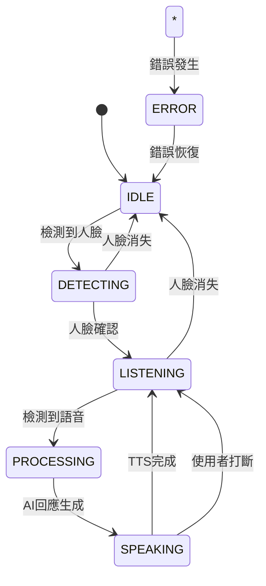

# 智慧語音助理 Android 應用

## 專案概述

這是一個基於 Android 平台的智慧語音助理應用，整合了人臉識別、語音活動檢測(VAD)、語音識別(STT)、AI對話和語音合成(TTS)功能，實現自然的人機互動體驗。

## 功能特性

### 🎯 核心功能

1. **人臉識別觸發**
   - 使用 Google ML Kit Face Detection 進行即時人臉檢測
   - 檢測到人臉時自動啟動語音收音功能
   - 支援多人臉場景，自動選擇最大人臉
   - 人臉離開時自動停止收音

2. **語音活動檢測 (VAD)**
   - 基於音頻能量的即時語音活動檢測
   - 自動識別使用者開始/結束說話
   - 避免錄製無聲片段，提升識別效率
   - 可調節檢測靈敏度

3. **語音識別 (STT)**
   - 整合 Whisper API 進行語音轉文字
   - 支援中文和英文語音識別
   - 高精度語音識別能力

4. **AI 對話處理**
   - 整合 OpenAI GPT API 作為對話大腦
   - 支援自然對話功能（問答、閒聊等）
   - 保持對話上下文和歷史記錄
   - 智慧回應生成

5. **語音合成 (TTS)**
   - 使用 Android 系統內建 TTS API
   - 支援中文和英文語音合成
   - 自然流暢的語音輸出
   - 可調節語速和音調

6. **自由麥克風模式**
   - 手動開關持續對話模式
   - VAD 持續運作，自動判斷說話段落
   - 支援連續對話體驗

7. **插話打斷機制**
   - AI 說話時支援使用者隨時插話
   - 檢測到使用者語音立即停止 TTS 播放
   - 快速切換到聆聽模式
   - 保持對話上下文連貫性

## 技術架構

### 🏗️ 架構設計

```
├── Presentation Layer (UI)
│   ├── Activities
│   ├── ViewModels (MVVM)
│   └── Adapters
│
├── Domain Layer (Business Logic)
│   ├── UseCases
│   ├── Models
│   └── Repository Interfaces
│
└── Data Layer
    ├── Repository Implementations
    ├── API Services
    └── Local Storage
```

### 🛠️ 技術堆疊

- **架構模式**: Clean Architecture + MVVM
- **開發語言**: Kotlin
- **依賴注入**: Dagger Hilt
- **UI框架**: Material Design Components + Data Binding
- **相機處理**: CameraX
- **人臉識別**: Google ML Kit Face Detection
- **網路請求**: Retrofit + OkHttp
- **非同步處理**: Kotlin Coroutines + Flow
- **語音合成**: Android TextToSpeech API

### 📋 必要整合

- **人臉識別**: Google ML Kit Face Detection
- **AI大腦**: OpenAI API (GPT-3.5/GPT-4)
- **VAD**: 基於音頻能量的簡化VAD演算法
- **STT**: Whisper API (自架版本)
- **TTS**: Android 系統內建 TTS API

## 安裝和配置

### 🔧 環境需求

- Android Studio Arctic Fox (2020.3.1) 或更高版本
- Android SDK API Level 24 (Android 7.0) 或更高
- Kotlin 1.9.10
- Gradle 8.0

### 📦 依賴安裝

1. **複製專案**
   ```bash
   git clone https://github.com/your-repo/voice-assistant-android.git
   cd voice-assistant-android
   ```

2. **配置 API Keys**
   
   在 `app/src/main/java/com/voiceassistant/app/data/repository/SpeechRepositoryImpl.kt` 中配置：
   ```kotlin
   private val openAiApiKey = "your_openai_api_key_here"
   ```

3. **配置 Whisper 服務**
   
   在 `app/src/main/java/com/voiceassistant/app/di/NetworkModule.kt` 中修改：
   ```kotlin
   .baseUrl("http://your-whisper-server.com/")
   ```

4. **同步專案**
   ```bash
   ./gradlew clean
   ./gradlew build
   ```

### 🚀 運行應用

1. 連接 Android 裝置或啟動模擬器
2. 在 Android Studio 中點擊 "Run" 按鈕
3. 授予應用相機和麥克風權限
4. 開始使用語音助理功能

## 使用說明

### 📱 介面操作

1. **啟動應用**
   - 應用啟動後會請求相機和麥克風權限
   - 授權後相機預覽介面會自動顯示

2. **人臉觸發模式**
   - 面向前置攝影機，應用會自動檢測人臉
   - 檢測到人臉後狀態指示器變為藍色"檢測中"
   - 開始說話時會自動進入"聆聽中"狀態

3. **自由模式**
   - 點擊"自由模式"按鈕進入持續對話模式
   - 在此模式下無需人臉觸發即可進行對話
   - 再次點擊可退出自由模式

4. **插話功能**
   - 當AI正在說話時（紫色"說話中"狀態）
   - 直接開始說話或點擊"打斷"按鈕可中斷AI
   - 立即切換到聆聽模式

5. **對話歷史**
   - 所有對話記錄會顯示在介面下方
   - 點擊"清除歷史"可清空對話記錄

### 🎛️ 狀態指示

- **灰色 - 待機中**: 應用閒置狀態
- **藍色 - 檢測中**: 正在檢測人臉
- **綠色 - 聆聽中**: 正在聆聽使用者語音
- **橙色 - 處理中**: 正在進行語音識別和AI處理
- **紫色 - 說話中**: AI正在進行語音回應
- **紅色 - 錯誤狀態**: 發生錯誤

## 效能分析

### ⚡ 延遲分析

| 模組 | 平均延遲 | 說明 |
|------|----------|------|
| 人臉檢測 | 50-100ms | 即時檢測，延遲較低 |
| VAD檢測 | 10-30ms | 基於音頻能量，回應快速 |
| 語音識別 | 1-3秒 | 取決於網路和語音長度 |
| AI對話 | 1-5秒 | 取決於網路和OpenAI回應時間 |
| 語音合成 | 500ms-2秒 | 系統TTS，延遲適中 |

### 🔋 資源使用

- **CPU使用率**: 15-25% (人臉檢測和音頻處理)
- **記憶體佔用**: 80-120MB
- **電池消耗**: 中等 (主要來自相機和持續音頻檢測)
- **網路流量**: 取決於對話頻率和長度

## 已知限制和改進方向

### ⚠️ 目前限制

1. **VAD演算法簡化**
   - 目前使用基於音頻能量的簡化VAD
   - 建議整合更先進的Silero VAD或類似開源方案

2. **音頻錄製功能**
   - 目前為概念實作，缺少完整的音頻錄製和快取
   - 需要新增音頻檔案管理和暫存儲存

3. **離線功能**
   - 依賴網路連線進行STT和AI對話
   - 可考慮整合本地語音識別和離線AI模型

4. **多語言支援**
   - 目前主要支援中文，英文支援有限
   - 可擴展多語言自動檢測和切換

### 🚀 未來改進

1. **更強大的VAD**
   - 整合Silero VAD或WebRTCVAD
   - 支援噪音環境下的語音檢測

2. **音頻優化**
   - 新增音頻降噪處理
   - 實現音頻串流處理和快取優化

3. **離線模式**
   - 整合本地STT模型(如Vosk)
   - 本地AI對話模型整合

4. **個人化功能**
   - 使用者偏好學習和記憶
   - 自訂喚醒詞支援
   - 聲紋識別和個人化回應

5. **擴充功能**
   - 情緒識別和情感回應
   - 手勢識別整合
   - 多模態互動支援

## 技術文件

### 🔄 狀態機設計



### 🌊 音頻處理流程

```
音頻輸入 → VAD檢測 → 語音片段 → STT處理 → 文字輸出
    ↓           ↓         ↓         ↓         ↓
  麥克風      能量分析    快取錄音   API調用   使用者輸入
```

### 🔗 API整合方式

1. **OpenAI API整合**
   ```kotlin
   // 配置API客戶端
   @POST("chat/completions")
   suspend fun createChatCompletion(
       @Header("Authorization") authorization: String,
       @Body request: ChatCompletionRequest
   ): Response<ChatCompletionResponse>
   ```

2. **Whisper API整合**
   ```kotlin
   // 語音檔案上傳和轉錄
   @Multipart
   @POST("transcribe")
   suspend fun transcribeAudio(
       @Part("file") audioFile: File,
       @Part("model") model: String = "whisper-1"
   ): Response<TranscriptionResponse>
   ```

### 🔐 權限管理

應用需要以下權限：
- `CAMERA`: 人臉檢測和相機預覽
- `RECORD_AUDIO`: 語音輸入和VAD檢測
- `INTERNET`: API調用和資料傳輸
- `ACCESS_NETWORK_STATE`: 網路狀態檢查

### 🔒 隱私保護

1. **資料處理**
   - 音頻資料僅用於即時處理，不進行本地儲存
   - 對話歷史儲存在本地，不上傳到雲端
   - 人臉檢測僅用於觸發，不儲存人臉影像

2. **API安全**
   - OpenAI API Key需要安全儲存
   - 建議使用加密儲存或環境變數
   - 網路傳輸使用HTTPS加密

## 貢獻指南

### 🤝 參與開發

1. Fork 專案儲存庫
2. 建立功能分支 (`git checkout -b feature/AmazingFeature`)
3. 提交變更 (`git commit -m 'Add some AmazingFeature'`)
4. 推送到分支 (`git push origin feature/AmazingFeature`)
5. 建立 Pull Request

### 📝 程式碼規範

- 遵循 Kotlin 官方編碼規範
- 使用有意義的命名和註解
- 保持程式碼簡潔和可讀性
- 新增適當的單元測試

## 授權條款

本專案採用 MIT 授權條款 - 查看 [LICENSE](LICENSE) 檔案了解詳情。

## 聯絡方式

如有問題或建議，請透過以下方式聯絡：

- 專案Issues: [GitHub Issues](https://github.com/your-repo/voice-assistant-android/issues)
- 電子郵件: your-email@example.com

## 致謝

感謝以下開源專案和服務：

- [Google ML Kit](https://developers.google.com/ml-kit) - 人臉檢測
- [OpenAI API](https://openai.com/api/) - AI對話處理
- [Android CameraX](https://developer.android.com/training/camerax) - 相機處理
- [Material Design](https://material.io/) - UI設計規範
- [Dagger Hilt](https://dagger.dev/hilt/) - 依賴注入

---

**注意**: 這是一個面試作業專案，重點展示架構設計和技術整合能力。部分功能為概念實作，實際生產環境使用需要進一步完善和優化。
